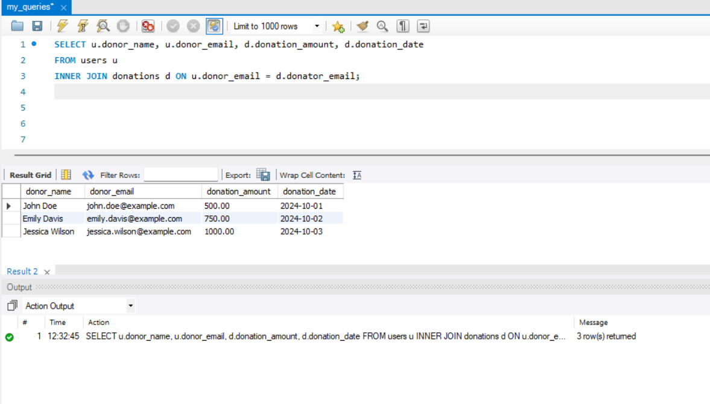
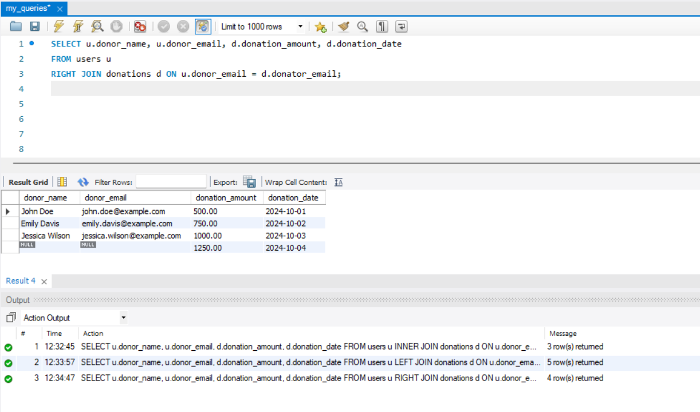

# SQL Practical Assignment 2

## Create database and perform all basic queries.

- **To Create Database** (CREATE & USE Query)

  `CREATE DATABASE blood_bank;`
  
  `USE blood_bank;`
  
  `CREATE TABLE users (`
  
    `donor_name VARCHAR(50),`

    `receiver_name VARCHAR(50),`

    `donor_age INT,`

    `receiver_age INT,`

    `donator_mobile_number VARCHAR(15),`

    `receiver_mobile_number VARCHAR(15),`

    `donator_email VARCHAR(50),`

    `receiver_email VARCHAR(50),`

    `donator_address VARCHAR(100),`

    `receiver_address VARCHAR(100)`
  
    `);`
  
  
  *Output:*

  

---

- **DROP Query**

  `DROP TABLE users;`
  
  *Output:*
  
  

---
  
- **INSERT Query**

  `INSERT INTO users (donor_name, receiver_name, donor_age, receiver_age, donator_mobile_number, receiver_mobile_number, donator_email, receiver_email, donator_address, receiver_address)`
  
  `VALUES`
  
  `('John Doe', 'Alice Smith', 34, 29, '9876543210', '9123456789', 'john.doe@example.com', 'alice.smith@example.com', '123 Donor St, City A', '456 Receiver St, City B'),`
  
  `('Emily Davis', 'Robert Johnson', 42, 36, '9988776655', '9776655443', 'emily.davis@example.com', 'robert.johnson@example.com', '789 Donor Ave, City C', '101 Receiver Ave, City D'),`
  
  `('Michael Brown', 'Sarah Miller', 27, 32, '9665544332', '9554433221', 'michael.brown@example.com', 'sarah.miller@example.com', '202 Donor Lane, City E', '303 Receiver Lane, City F'),`
  
  `('Jessica Wilson', 'James Taylor', 30, 40, '9443322110', '9332211009', 'jessica.wilson@example.com', 'james.taylor@example.com', '404 Donor Blvd, City G', '505 Receiver Blvd, City H'),`
  
  `('Daniel Moore', 'Linda Harris', 50, 45, '9112233445', '9009988776', 'daniel.moore@example.com', 'linda.harris@example.com', '606 Donor Rd, City I', '707 Receiver Rd, City J');`
  
  
  
  *Output:*
  
  

---

- **SELECT Query**

  `SELECT * FROM blood_bank.users;`
  
  *Output:*
  
  

---

- **UPDATE & WHERE Query**

  `UPDATE users`
  
  `SET donor_age = 35, donator_mobile_number = '9998887776'`
  
  `WHERE donor_name = 'John Doe';`
  
  *Output:*
  
  

---

- **ALTER Query**

  `ALTER TABLE users`
  
  `CHANGE donator_email donor_email VARCHAR(50);`
  
  *Output:*
  
  

---

- **ORDER BY Query**

  `SELECT donor_name, donor_age`
  
  `FROM users`
  
  `ORDER BY donor_age ASC;`
  
  *Output:*
  
  

---

- **Inner Join Query**

  `SELECT u.donor_name, u.donor_email, d.donation_amount, d.donation_date`
  
  `FROM users u`
  
  `INNER JOIN donations d ON u.donor_email = d.donator_email;`  
  
  *Output:*
  
  
---

- **Left Join Query**

  `SELECT u.donor_name, u.donor_email, d.donation_amount, d.donation_date`
  
  `FROM users u`
  
  `LEFT JOIN donations d ON u.donor_email = d.donator_email;`
  
  *Output:*
  
  

---

- **Right Join Query**

  `SELECT u.donor_name, u.donor_email, d.donation_amount, d.donation_date`
  
  `FROM users u`
  
  `RIGHT JOIN donations d ON u.donor_email = d.donator_email;`

  *Output:*
  
  

---

- **Full Outer-Join Query**

  `SELECT u.donor_name, u.donor_email, d.donation_amount, d.donation_date`
  
  `FROM users u`
  
  `LEFT JOIN donations d ON u.donor_email = d.donator_email`
  
  `UNION`
  
  `SELECT u.donor_name, u.donor_email, d.donation_amount, d.donation_date`
  
  `FROM users u`
  
  `RIGHT JOIN donations d ON u.donor_email = d.donator_email;`
 
  
  *Output:*
  
  
